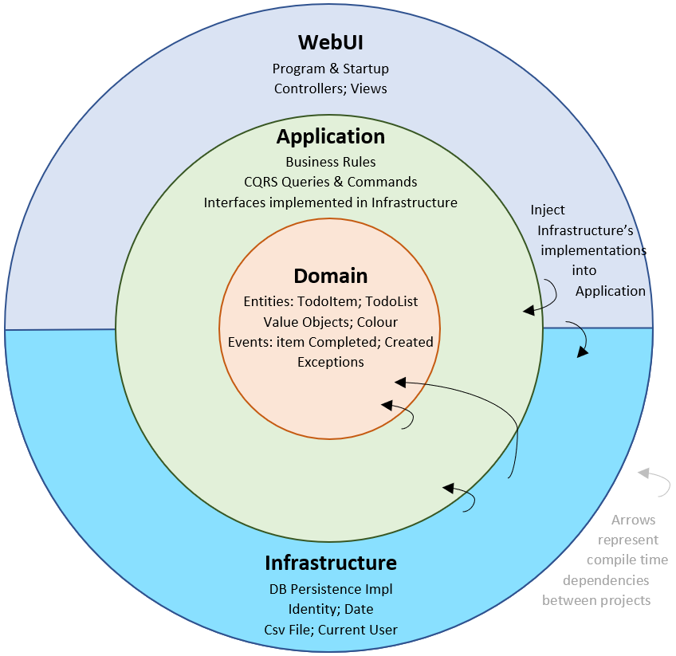

= Introduction

These are notes in regards to Architecture Testing. A simple type of Unit Testing
that brings project security in a different form.

== Code

I have setup a small project in order to test different patterns that can be useful
when doing Architecture testing for DOTNET:

https://github.com/diegowrhasta/archunit-dotnet[Github]

== Background

The more you do software development, the more you realize that this is hard
subject, and even harder career to really establish yourself with. This isn't
related to one's mental capacity whatsoever, but there are so many variables you
have juggle with that sometimes we tend to forget to keep things in check, and
more often than not, you always end up with the typical tale pattern that's as
old as time:

[quote, A disillusioned developer]
____
_Dev:_ Man, I can't wait to start this new project with a really beatifully crafted design
both for folder structure, but also from the very Architectural and inception
decision.

_> Months pass_

_> Dev leaves for another company_

_> Dev comes back after a while_

_Dev:_ Can't wait to see how my _baby_ has been treated after all these years?

_Dev:_ Wait, why have all the decisions and designs that I so carefully documented not
being followed? Why are there all these files in this folder? This doesn't make any
sense, I explicitly stated that we should be relying on interfaces and yet here
they are making the code harder to maintain with all the coupling in these
instances started at the constructor? Please stooooop.
____

There used to be a time in which I thought I had to have all the rules, all the
knowledge ingrained into my brain and to always apply that in Code Reviews, and
when designing new solutions. But that's, (imo) _still a junior speaking_. In
the real world, we don't have the luxury of time, nor the luxury of dealing with
some really small application that we can wrap our head around with easily.

And so, as **software developers**, we _should_ make good usage of our own skills.
Our own abilities. And that is **_writing software_**. We can automate tasks,
we can automate so many things with the right mindset, with the right goal in mind.
And so, _assuming the theory of unit testing/integration testing_. We know that
tests are a great way to document code, to add a safety net to everything we did
so that we try to minimize pushing code with bugs or weird edge cases lurking in the
shadows ready to strike whenever we lower our guard.

=== Architecture Testing

And that's how we land on a simple idea: _Why don't we document our folder structure/
architecture on top of keeping everyone in check in case they didn't follow the fules_?_
And that's when we can write a simple test suite, that will solely focus on scanning
the whole project/solution and check all the code written against our architecture
rules.

- _You wrote a Feature/Service/Business Logic class in the wrong folder?_
	- The test will blow up and immediately tell you to **FIX THAT**
		- The seniors won't have to spend time telling the juniors about how they
		need to refactor _this or that_, they delegate that **to the test**, **the test**
		is now the senior keeping in check of people going rogue.
- _You made a project reference from one layer to another even though that should
be illegal and you will create this tech debt that will go unnoticed until it is
too late?_
	- The test will tell you **STOP**.
		- So that one _small decision_ that someone made because they didn't know,
		or because they thought they knew better, will be policed automatically.

=== Value

And so, with this simple idea in mind, we can offload work that otherwise would
overwhelm people, specially in big projects when there's a lack of time, a lack
of motivation and our dreams can end up crushed because we wanted to do _amazing
software_. The way the **Gang of Four** intended, but reality often had other _plans_
for us.

This repo is .NET focused, but the underlying concepts, specially for the different
architectural patterns I think can be useful to anyone, the idea is to establish
a well researched and accurate set of rules, and stick to them, _and making the
tests being the autoamted policeman enforcing them_.

== Clean Architecture

The Clean Architecture pattern (and for our purposes, folder structure pattern),
stays that there are 4 layers to an application

- Domain/Core
- Application
- Infrastructure
- WebUI / Client

There are tons of other ideas and theory for them but we will simplify rules according
to our technical concerns and needs:

The **Golden Rule** states that dependencies should flow **_INWARDS_**. That means,
we should have a dependency tree as such:

WebUI -> Infrastructure -> Application -> Domain/Core

We should **NEVER** have dependencies that flow the other way:

- Domain/Core -> Application

Having such a project reference should be _forbidden_.

This is but one clear example of the rules that the pattern states and what we
should code to be enforced. Of course we will add the different uses cases and concepts
further down, but this is the idea.

=== Layer Dependency Check

As stated in the example, we want to make sure that the 4 layers have dependencies
flowing inwards, nothing more than that. And so, we can write some tests:

[source, csharp]
.LayerDependencyTests.cs
----
using ArchUnitNET.Domain;
using ArchUnitNET.Loader;
using ArchUnitNET.Fluent;
using ArchUnitNET.xUnit;
using static ArchUnitNET.Fluent.ArchRuleDefinition; <.>

namespace Wan.ArchUnitTests.CleanArchitecture.Tests;

public class LayerDependencyTests
{
    private static readonly System.Reflection.Assembly CoreAssembly =
        System.Reflection.Assembly.Load("Wan.ArchUnitTests.CleanArchitecture.Core"); <.>

    private static readonly System.Reflection.Assembly ApplicationAssembly =
        System.Reflection.Assembly.Load("Wan.ArchUnitTests.CleanArchitecture.Application"); <.>

    private static readonly Architecture Architecture =
        new ArchLoader().LoadAssemblies(
            CoreAssembly,
            ApplicationAssembly
        ).Build();

    private static readonly IObjectProvider<IType> CoreLayer =
        Types().That().ResideInAssembly(CoreAssembly).As("Core Layer"); <.>

    private static readonly IObjectProvider<IType> ApplicationLayer =
        Types().That().ResideInAssembly(ApplicationAssembly).As("Application Layer");

    [Fact]
    public void Core_Should_Not_Depend_On_Application()
    {
        var rule = Types()
            .That().Are(CoreLayer)
            .Should().NotDependOnAny(ApplicationLayer)
            .Because("Core should not have dependencies on Application layer"); <.>

        rule.Check(Architecture); <.>
    }
}
----
<.> These are all necessary imports that you need in order for all ArchUnit's
utility methods and types to be available to you.
<.> A good pattern is to keep all the assemblies you are referencing in their own
private field, that way you get a variable to reference when loading them later,
but you can also leverage this field to then run a check against it pretty easly.
<.> Another example of referencing, it might be a bit "ugly" since we are using
magic strings here, but we have to make some compromises (and I'm sure there's an
obscure way of doing this with hard types and so on). Also **_big note:_** Be sure
that the `Test` project references all these assemblies that you are trying to
load/resolve. If you don't have them referenced then this line will fail.
<.> As you can see, we can now reference the assembly variable in here and avoid the
usage of magic strings.
<.> It's nice that we can leverage a _Fluent Pattern_ here since it reads better
to us, and allows for all manners of other possibilities. It's nice that we also
get to add metadata to the message like this.
<.> And The moment you have "configured" the rule as you see fit, then you can just
run it with `Check`.

And this is great, the moment any class in `Core` has a declaration to a class in
`Application` the test blows up. (_You can try and verify that if you want_). This
will then keep enforced the design decision of "NO REFERENCES TO THE OUTSIDE". Which
Clean Architecture enforces. Anyone who reads the code, or gets policed will then
retroactively **learn** about this project detail and slowly but surely _start
coding with that in mind_.

[NOTE]
====
Be aware that, ArchUnit is technically a bit `overkill`, specially since we are
doing assembly loading. If you were to run simple unit tests you can get execution
times of _< 50 ms_. But ArchUnit tests are around _250~ ms_. So they are in a way
_slower/heavier_. But you shouldn't really fret over that. Unless you are doing
something **extremely wrong**, tests should still adhere to the principle of
_they should be really fast_.
====
